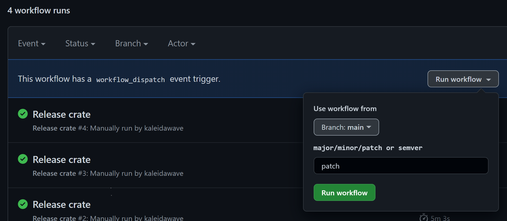

# Crates release GitHub action

Action for automatic incrementing of crate version and publishing to [crates.io](https://crates.io)

Inputs:
- `version`: a version argument, Can be major/minor/patch or semver. For monorepos a comma-seperated
- `crates-token`: a crates.io publishing token (get from <https://crates.io/settings/tokens>)
- `working-directory`: the path to where the crate is (default ".")
- `publish-crates`: whether to publish the crates (default "true") (otherwise left to the user to implement based on outputs)

Outputs:
- `new-versions`, A JSON array of crates and their new version e.g. `[0.2.0]`. For monorepos this is `["*crate-name*-*version*"]` e.g. `["my-crate-0.2.0", "other-crate-0.3.0"]`
- `new-versions-json-object`, A JSON object of crate name and new version pairs
- `new-version`, A single new version, "none" if multiple crates are updated e.g. `[0.2.0]`.
- `new-versions-description`, For single projects the literal new version. For monorepos a chain of results e.g. `crate1 to 0.1.0, crate2 to 0.2.0 and crate3 to 0.3.0`

### Example usage

The following example is a [dispatch_workflow](https://docs.github.com/en/actions/managing-workflow-runs/manually-running-a-workflow) for updating updating the crate version, releasing on crates.io, creating a git tag and pushing updated `Cargo.toml` to the repository.

```yml
name: Release crate

on:
  workflow_dispatch:
    inputs:
      version:
        description: "major/minor/patch or semver"
        required: false
        default: "patch"

concurrency: release-crate

jobs:
  publish:
    runs-on: ubuntu-latest
    steps:
    - id: checkout
      uses: actions/checkout@v4

    - id: auth
      uses: rust-lang/crates-io-auth-action@v1

    - id: release
      name: Crates publish
      uses: kaleidawave/crates-release-gh-action@improvements
      with:
        version: ${{ github.event.inputs.version }}
        crates-token: ${{ steps.auth.outputs.token }}

    - name: Push updated Cargo.toml
      run: |
        git config user.name "github-actions[bot]"
        git config user.email "41898282+github-actions[bot]@users.noreply.github.com"
        git commit -m "Release: ${{ steps.release.outputs.new-version }}"
        git tag "release/${{ steps.release.outputs.new-version }}"
        git push --tags origin ${{ steps.checkout.outputs.ref }}
```

This can then be run either from the web gui:



or using the [GitHub CLI](https://cli.github.com/):

```
gh workflow run crates.yml -f version=patch
```

### Example usage in a monorepo

Useful if dealing with a associated derive crate. Here is a modification of the above that supports a repository with two crates.

```yml
todo
```

### Examples / demos

- [ezno](https://github.com/kaleidawave/ezno) (deploys many crates + conditionally)
- [syn-helpers](https://github.com/kaleidawave/syn-helpers)
- [temporary-annex](https://github.com/kaleidawave/temporary-annex)
- [enum-variants-strings](https://github.com/kaleidawave/enum-variants-strings) (deploys two crates)
- TODO more
