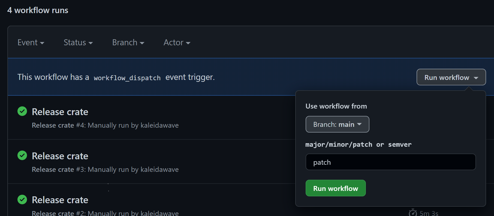

# Crates release GitHub action

Action for automatic incrementing of crate version and publishing to [crates.io](https://crates.io)

Inputs: 
- `version`, A version argument, Can be major/minor/patch or semver. For monorepos a JSON map of crate name to release argument
- `crates-token`, A crates.io publishing token (get from https://crates.io/settings/tokens)

Outputs:
- `new-version`, A JSON array of crates and their new version e.g. `[0.2.0]`. For monorepos this is `["*crate-name*-*version*"]`
- `new-version-description`, For single projects the literal new version. For monorepos a chain of results e.g. `crate1 to 0.1.0, crate2 to 0.2.0 and crate3 to 0.3.0`

### Example usage

The following example is a [dispatch_workflow](https://docs.github.com/en/actions/managing-workflow-runs/manually-running-a-workflow) for updating updating the crate version, releasing on crates.io, creating a git tag and pushing updated `Cargo.toml` to the repository.

```yml
name: Release crate

on:
  workflow_dispatch:
    inputs:
      version:
        description: "major/minor/patch or semver"
        required: false
        default: "patch"

jobs:
  publish:
    runs-on: ubuntu-latest
    steps:
      - uses: actions/checkout@v3
      - name: Set git credentials
        run: |
          git config user.name github-actions
          git config user.email github-actions@github.com
      - name: Crates publish
        uses: kaleidawave/crates-release-gh-action@main
        id: release
        with:
          version: ${{ github.event.inputs.version }}
          crates-token: ${{ secrets.CARGO_REGISTRY_TOKEN }}
      - name: Push updated Cargo.toml
        run: |
          firstUpdateVersion=$(echo '${{ steps.release.outputs.new-versions }}' | jq -r '.[0]')
          git tag "v$firstUpdateVersion"
          git add .
          git commit -m "Release: ${{ steps.release.outputs.new-versions-description }}"
          git push --tags origin main
```

This can then be run either from the web gui: 



or using the [GitHub CLI](https://cli.github.com/):
```
gh workflow run crates.yml -f version=patch
```

### Examples / demos:

- [syn-helpers](https://github.com/kaleidawave/syn-helpers)
- [temporary-annex](https://github.com/kaleidawave/temporary-annex)
- [enum-variants-strings](https://github.com/kaleidawave/enum-variants-strings) (deploys two crates)